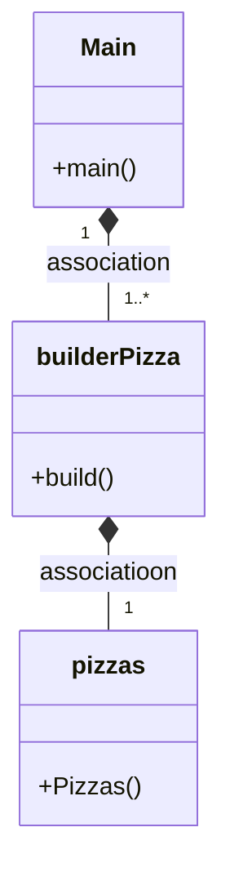
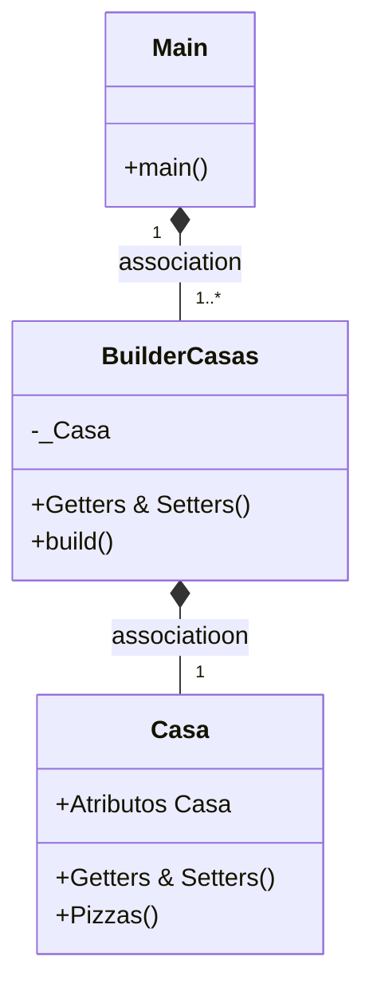

# PATRON BUILDER 


## ¿Que es?
El builder es un diseño que permite al constroctor de una clase poder cambiar objetos complejos paso a paso. Esto te permite producir diferentes tipos y representaciones de un objeto utilizando el mismo constructor


## Clases
Tenemos la clase Pizza que tiene dos constructores, uno para dar valores y el otro por defecto, el que usaremos para el patrón,
ademas de esto la clase tiene sus getters y setters

Tenemos tambien la clase builderPizzas. Que tiene un constructor default con el constructor por defecto de Pizzas. Despues tenemos setters que devuelven BuilderPizzas. Y por último tenemos el método build(), que devuelve el objeto del constructor.


## ¿Se puede combinar el builder con factory?
Si, de forma que podamos crear de forma personalizada cada uno de los tipos de objetos que tenemos en la Factory





# BUILDER EXAMEN

## Pregunta 1-.

---

### ¿Cual es la función del patrón builder? Pon ejemplo (que no sea Pizzas)

El patrón builder nos da la oportunidad de crear varios objetos "personalizados" a partir
de la misma base, simplemente añadiendo las lineas de modificacion de variables, osea "setters"
y la linea clave del builder "build".

Un ejemplo sería el de Casas, en el que queremos que las casas puedan tener o no sus partes (Ventanas,Garage,Piscina,etc..).

Para ello creariamos la clase Casa, co todos estos atributos y sus getter y setter,
luego creariamos la clase BuilderCasas, en la que tendremos un objeto Casa privado que modificaremos con getters y setters,
y finalmente devolveremos en el metodo Build.

## Pregunta 2-.

---

### ¿Como es su Diagrama de clases de este ejemplo mque has hecho? Realiza en el readme el diagrama

En el siguiente Diagrama de clases no se han escrito 1 por 1 ni los Getter y los Setters (reducidos a "Getters & Setters"),
 ni los atributos de la clase Casa que serian usados para los objetos mas adelanto (reducidos a "Atributos Casa").




## Pregunta 3-.

---

### ¿Podríamos combinarlo con el patrón Factory? Explícalo con algo de código como lo harías

La forma en la que creo que se podrían combinar ambos patrones sería (usando como ejemplo el proyecto de transportes) añadiendo una
clase BuilderTransportes que tenga un metodo de elección (switch) que nos permita a su vez cambiar los atributos del objeto
en su creación.

El siguiente metodo recibiría el tipo de objeto que se quiere crear
```
private ITransporte _Transporte;

public BuilderTransporte{
        switch (numero){
            case 1:
                _Transporte = Factoria.getProducto(type);
                coste = _Transporte.costeTotal(Factoria.cp);
                nTipo = _Transporte.tipoEmbalaje(Factoria.dimensionX,Factoria.dimensionY,Factoria.dimensionZ,Factoria.peso);
                break;
            case 2:
                _Transporte = Factoria.getProducto(type);
                coste = _Transporte.costeTotal(Factoria.cp);
                nTipo = _Transporte.tipoEmbalaje(Factoria.dimensionX,Factoria.dimensionY,Factoria.dimensionZ,Factoria.peso);
                break;
            case 3:
                _Transporte = Factoria.getProducto(type);
                coste = _Transporte.costeTotal(Factoria.cp);
                nTipo = _Transporte.tipoEmbalaje(Factoria.dimensionX,Factoria.dimensionY,Factoria.dimensionZ,Factoria.peso);
        }
}

(Getters & Setters de los atributos modificables)

public Transportes build(){return this._Transporte}

```

De esta forma al crear un objeto tipo Transporte mediante el builder no solo podriamos cambiar atributos sino que usar tambien el
Factory e elegir el "tipo de objeto", en este caso, el tipo de Transporte.