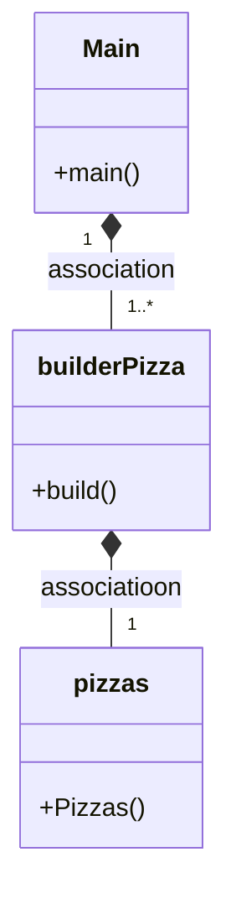

# PATRON BUILDER 

## ¿Que es?
El builder es un diseño que permite al constroctor de una clase poder cambiar objetos complejos paso a paso. Esto te permite producir diferentes tipos y representaciones de un objeto utilizando el mismo constructor

## Clases
Tenemos la clase Pizza que tiene dos constructores, uno para dar valores y el otro por defecto, el que usaremos para el patrón,
ademas de esto la clase tiene sus getters y setters

Tenemos tambien la clase builderPizzas. Que tiene un constructor default con el constructor por defecto de Pizzas. Despues tenemos setters que devuelven BuilderPizzas. Y por último tenemos el método build(), que devuelve el objeto del constructor.

## ¿Se puede combinar el builder con factory?
Si, de forma que podamos crear de forma personalizada cada uno de los tipos de objetos que tenemos en la Factory

